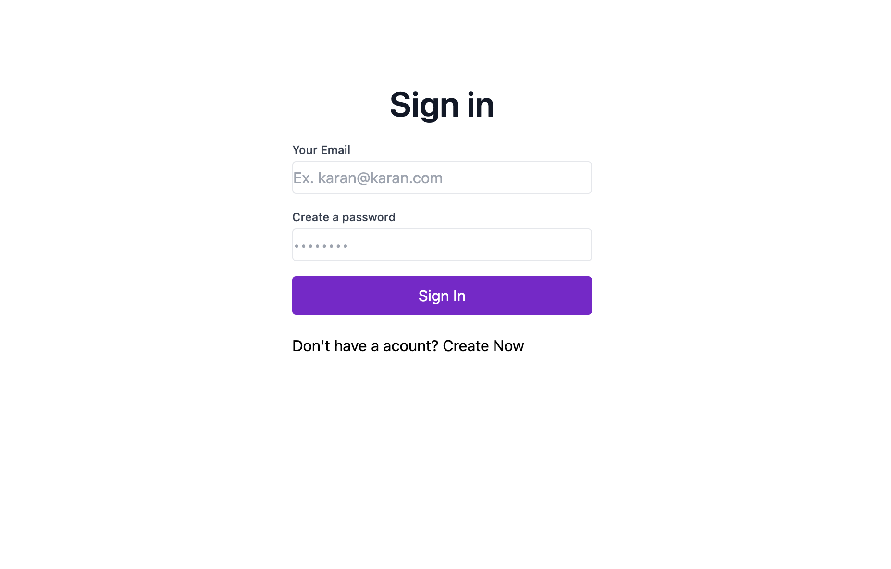
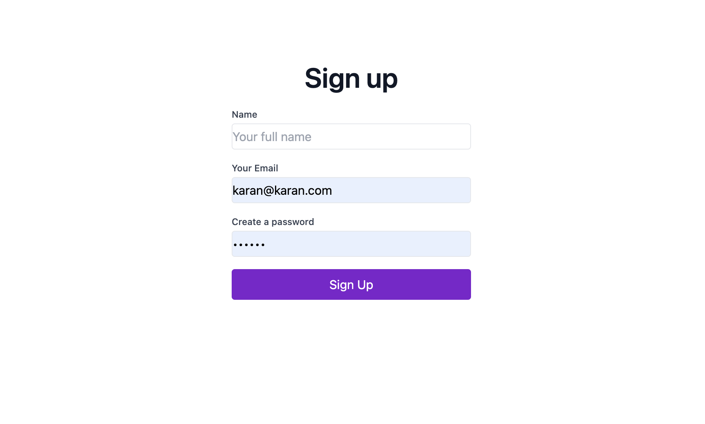
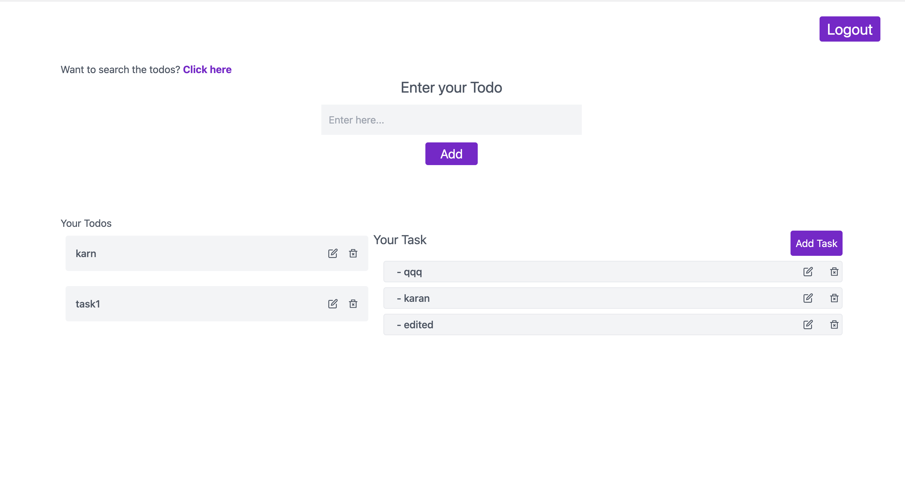
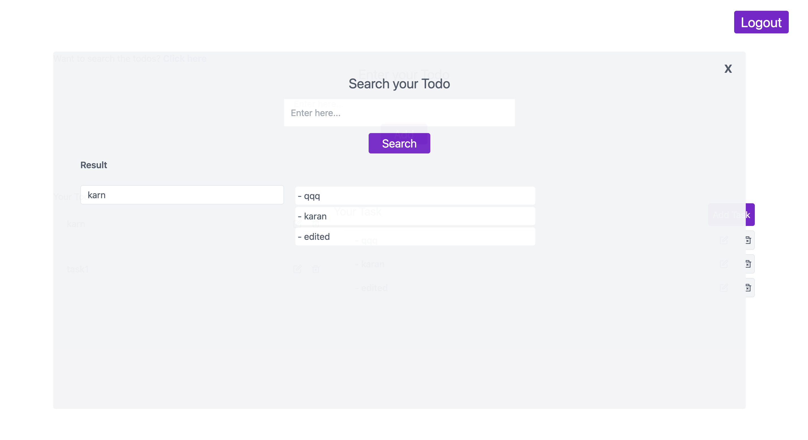

## This is full stack Todo App (MERN Stack)
### Features
- User Registration
- User Authentication
- User Authorization using JWT
- User can have multiple tasks contained in a todo
- User can create, update and delete both todo and task
### Time Taken - 7 days

### Screen Shots

### Dashboard

### Search Option
